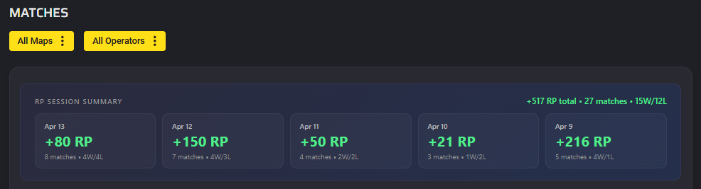
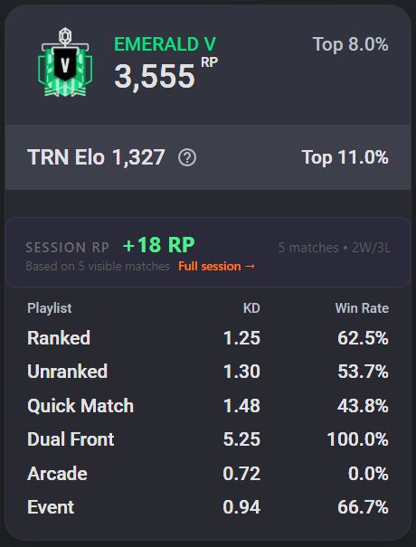

# R6 Stats Extension

Chrome extension for Rainbow Six Siege that injects **RP session balance** into [tracker.gg](https://r6.tracker.network) match history and provides **quick links** to popular stat trackers.

## Features

### RP Session Summary
- **Daily RP badges** injected into tracker.gg match history headers showing per-day RP balance
- **Session summary banner** on `/matches` (full layout) and `/overview` (compact)
- Auto-refreshes when clicking "Load More"
- Color-coded: green for positive, red for negative RP

### Quick Links Popup
- Fast access to your profile on **Tracker.network** and **Stats.cc**
- Supports username, platform (PC/PSN/Xbox), and GUID configuration
- Auto-fetches your avatar from tracker.gg

## Screenshots

| RP Session Summary (match history) | Compact overview widget |
|---|---|
|  |  |

## Installation

### From Release (recommended)
1. Download the latest `.zip` from [Releases](https://github.com/Guliveer/r6-stats-extension/releases)
2. Unzip to a folder
3. Open `chrome://extensions/` in Chrome
4. Enable **Developer mode** (top right toggle)
5. Click **Load unpacked** and select the unzipped folder

### From Source
```bash
git clone https://github.com/Guliveer/r6-stats-extension.git
cd r6-stats-extension
npm ci
npm run build
```
Then load the `dist/` folder as an unpacked extension.

## Setup

1. Click the extension icon (orange **R6** in toolbar)
2. Enter your **username** (e.g. `Heenull.FLM`)
3. Select your **platform** (PC / PSN / Xbox)
4. *(Optional)* Enter your **GUID** for stats.cc links — find it in your tracker.gg profile URL
5. Click **Save**

> **Note:** Tracker.network accepts both username and GUID in the URL. Stats.cc requires both username and GUID.

## How It Works

The extension injects a content script on `r6.tracker.network` profile pages that:
- Scans `.v3-match-row` elements for RP change data (`RP3,475 +47`)
- Groups matches by day using the time indicators (`2h ago`, `1d ago`)
- Injects RP balance badges into existing daily summary headers
- Adds an RP Session Summary banner above the match list

## Tech Stack

- **TypeScript** + **Vite** (build)
- **Tailwind CSS** (popup styling)
- **Chrome Manifest V3** (service worker, content scripts, storage API)
- **GitHub Actions** (CI/CD — auto-release on push)

## License

[MIT](LICENSE)
